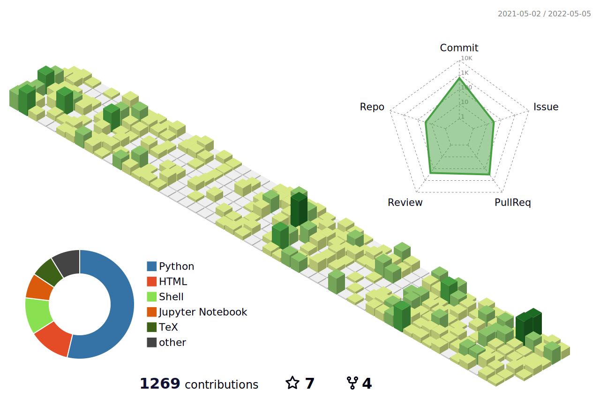

<h1 align="center">
  
</h1>

Hi! My name is Tetsuo Koyama. I'm a CAE software engineer in Japan. I'm interested in scientific computing and visualization with computer graphics. I am a committer of GetFEM and the developer team of [PyVista](https://github.com/orgs/pyvista/people).

<h1 align="center">

  

  

</h1>

<!-- Like のバッジ -->

<!-- Articles のバッジ -->

<!-- Followers のバッジ -->

<!-- Books のバッジ -->

<!-- Scraps のバッジ -->

 
 

<!--
**hrntsm/hrntsm** is a ✨ _special_ ✨ repository because its `README.md` (this file) appears on your GitHub profile.

Here are some ideas to get you started:

- 🔭 I’m currently working on ...
- 🌱 I’m currently learning ...
- 👯 I’m looking to collaborate on ...
- 🤔 I’m looking for help with ...
- 💬 Ask me about ...
- 📫 How to reach me: ...
- 😄 Pronouns: ...
- ⚡ Fun fact: ...
-->

 
 

 
 
<h1 align="center">
  

    
  

</h1>
