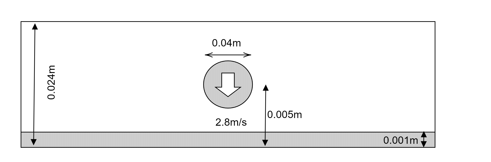

.. opencae2021M-03 documentation master file, created by
   sphinx-quickstart on Fri Dec  3 22:03:41 2021.
   You can adapt this file completely to your liking, but it should at least
   contain the root `toctree` directive.

================================
粒子法によるミルククラウンの解析
================================

@tkoyama010

.. こんにちは @tkoyama010 です。
   よろしくお願いします。

今回やったこと
==============

- PySPHを使用して粒子法でミルククラウンの解析をしました。
- Paraviewを使用してミルククラウンをレンダリングしたアニメーションを作成しました。

.. タイトルが有限要素法ではなく粒子法になっていますが、これは間違えではありません。
   有限要素法でミルククラウン解析をすると届け出ていましたが間に合いませんでした。
   ごめんなさい。
   有限要素法で計算しないとだからといって何も出さないのももったいないですので今回は粒子法で問題を解いてきたという話をさせていただきます。
   使用したソフトはpysphというソフトでSPH法を使用したPythonのフレームワークの一つです。
   また、PyVistaで可視化をするつもりでしたが機能の調査が必要なため暫定的にParaviewで可視化を行いました。
   今回、SPHを可視化するにはPyVista使い方でまだ検討しなければいけない部分があることがわかりました。
   そこで、今回は可視化にはParaviewを使っています。

PySPHの解析事例
===============

.. raw:: html

    

    <iframe width="840" height="472.5"
        src="https://www.youtube.com/embed/videoseries?list=PLH8Y2KepC2_VPLrcTiWGaYYh88gGVAuVr"
        frameborder="0" allowfullscreen>
    </iframe>
    

.. PySPHは、Smoothed Particle Hydrodynamics (SPH)シミュレーションのためのPythonのオープンソースフレームワークです。
   ユーザーは純粋な Python でSPH定式化を実装しても、優れた性能を得ることができますとのことです。
   PySPHを使ったシミュレーションの動画をご紹介します。

ミルククラウンの解析
====================

.. 今回はこのフレームワークを使用してミルククラウンの解析を行いました。
   モデルは日本計算工学会の有限要素法による流れのシミュレーションから引用しました。
   既存の有限要素法解析では上昇した水面の先端部においてクラウン状の水面形状が発生しているところまで確認できています。
   球状の液滴を高さ0.005mの位置から初速2.8m/sで落下させました。
   メッシュ分割は0.0001mであり、解析領域全体の分割数は水平400✕奥行400✕鉛直240分割です。
   重力加速度は、g=9.80665m/s2としました。
   また、時間増分量 :math:`1.2 \times 10^{-5} s`としました。

解析の実行方法
==============

.. code-block:: bash

   $ sudo apt-get install python-pysph # pysphのインストール
   $ git clone git@github.com:tkoyama010/pysph.git # 今回のスクリプトのチェックアウト
   $ cd pysph
   $ git checkout feat/milk-crown
   $ cd ../
   $ python3 ./pysph/pysph/examples/milk_crown.py # スクリプトの実行
   $ pysph dump_vtk milk_crown_output # vtkへの出力

.. 今回のスクリプトを実行するためのコマンドです。
   環境はUbuntu20.04を使用しました。
   次にこちらのコマンドで私がフォークしたリポジトリをチェックアウトしてpysphを実行してください。
   そしてpysphをインストールしてください。
   スクリプトを実行すると結果のフォルダmilk_crown_outputが作成されます。
   dump_vtkコマンドでvtkファイルが同じディレクトリに出力されます。

結果の可視化
============

.. raw:: html

    

    <iframe width="840" height="472.5"
        src="https://www.youtube.com/embed/1OEsr0S0gBE"
        frameborder="0" allowfullscreen>
    </iframe>
    

.. Paraviewで可視化した結果がこちらになります。
   液滴が水面に落下し、その衝撃で水面が円筒状に上昇していることがわかります。
   しかし、上昇した水面の先端部においてクラウン状の水面形状が発生しているところまでは確認できませんでした。
   考えられる理由としては今回の計算では気体部分を真空と過程しており気圧がかかっていないことがあげられます。
   流体の専門の方には常識なのかもしれませんが、液体の背景にこのようにチェッカーの板を配置することで液体の動きがよく分かることに今回気が付きました。
   以上です。ご清聴ありがとうございました。
