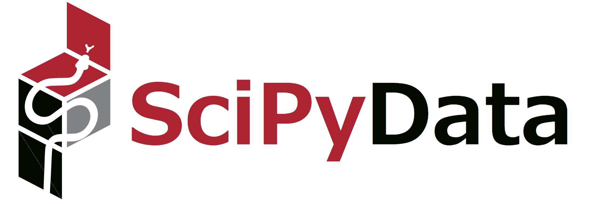

# SciPyDataJapan 2025へようこそ

---

## SciPyDataJapanとは？

- **NumFOCUS**のもとで開催されるカンファレンスです！
- **科学技術**と**データ**をつなぐ、Python好きのためのイベント。

---

## お伝えしたいこと

- **ゆるくて楽しい会**です！
- SNSのハッシュタグは `#scipydata2025` です。
- :camera: **写真撮影OKなスピーカーは申し出てください。**

---

## なぜやるのか？

- アメリカで開催されているSciPyConfを日本でもやりたい。
- 日本のPyDataの人たちの話も聞いてみたい。

---

## :beer: 非公式アナウンス

- 終了後に有志で懇親会をします。
